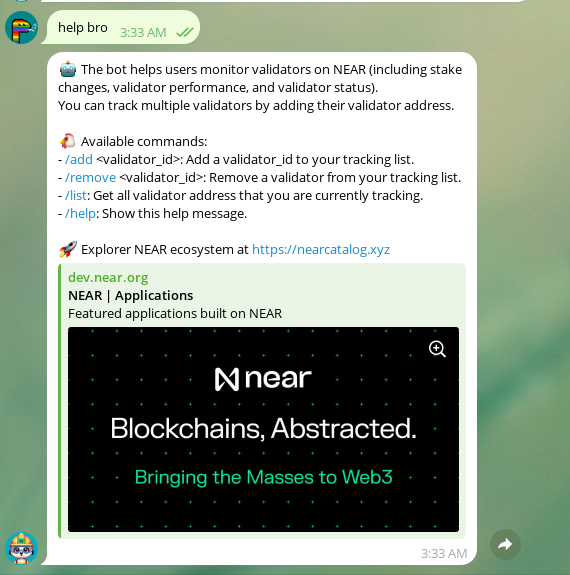

## [PRIVATE] Introduction NEAR validator watcher bot 


	

	


## Config

- config params in `config.env`  

- Config the cron schedule in `cron.js`

## Run

```
pnpm i
node index.js
```

After first running you will get the first message to you Telegram messenger and current state will be saved to `data/chat_pool_ids.csv`
